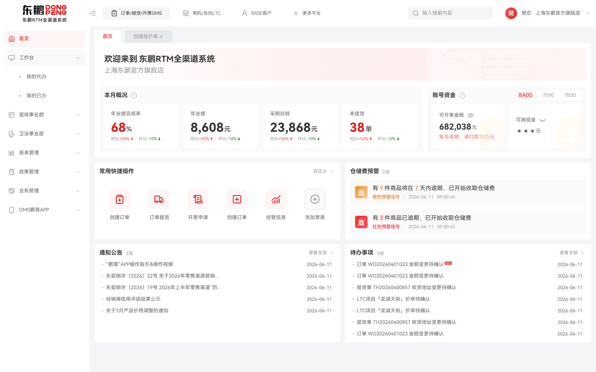

# RTM 提货订单列表

## AI Generated Example

This is the first example case for the Dongpeng UI Design Skill.

## Screenshot

## Pattern

- Enterprise Application Shell
- Enterprise Tabs
- Enterprise Page Container
- Enterprise List Page

## Components

- button-primary, button-secondary, button-tertiary, button-text-primary
- input-default, filter-operator-select, date-range-picker
- table-default, checkbox-default, Status Tag, Pagination
- Selection Toolbar

## Validation result

- Uses the RTM order business status mapping.
- Uses the brand-red-gradient for primary actions and active pagination.
- Uses a 44px table header and 48px table rows.
- Uses the Date Range Picker, Table Selection, and Pagination Footer rules.

The source page is maintained separately as an existing demo; this example records its Design System pattern and validation intent.
